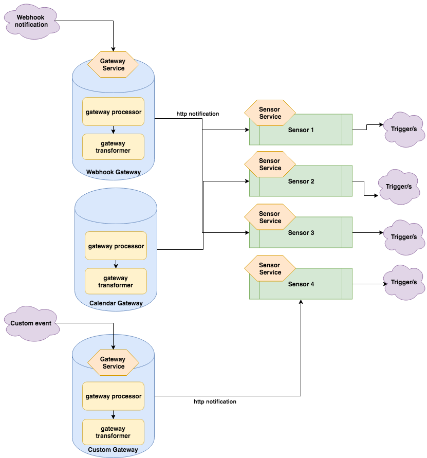

# Argo Events - The Event-Based Dependency Manager for Kubernetes

## What is Argo Events?
Argo Events is an event-based dependency manager for Kubernetes. The core concept of the project are
 * `gateways` which are implemented as a Kubernetes-native Custom Resource Definition that process events from event source.
    
 * `sensors` which are implemented as a Kubernetes-native Custom Resource Definition that define a set of event dependencies and trigger actions.

    - Define multiple dependencies from a variety of gateway event sources
    - Build custom gateways to support business-level constraint logic
    - Trigger Kubernetes object creation after successful dependency resolution
    - Trigger escalation after errors, or dependency constraint failures
    - Build and manage a distributed, cross-team, event-driven architecture
    - Easily leverage Kubernetes-native APIs to monitor dependencies

## Why Argo Events?
- Runtime agnostic. The first runtime and package agnostic event framework for Kubernetes.
- Containers. Designed from the ground-up as Kubernetes-native. 
- Extremely lightweight. All gateways, with the exception of calendar-based gateways, are event-driven, meaning that there is no polling involved.
- Configurable. Configure gateways at runtime
- Scalable & Resilient.
- Simple or Complex dependencies. Manage everything from simple, linear, real-time dependencies to complex, multi-source, batch job dependencies.

 
 

 
 

## Getting Started

 
 

1. [Installation](./docs/quickstart.md)
2. [Sensor and gateway controllers](docs/controllers-guide.md)
3. [Learn about gateways](docs/gateway-guide.md)
4. [Learn about sensors](docs/sensor-guide.md)
5. [Learn about triggers](docs/trigger-guide.md)
6. Install Gateways and Sensors
    1. [Webhook](gateways/core/webhook/install.md)
    2. [Artifact](gateways/core/artifact/install.md)
    3. [Calendar](gateways/core/calendar/install.md)
    4. [Resource](gateways/core/resource/install.md)
    5. [File](gateways/core/file/install.md)
    6. Streams
        1. [NATS](gateways/core/stream/nats/install.md)
        2. [KAFKA](gateways/core/stream/kafka/install.md)
        3. [AMQP](gateways/core/stream/amqp/install.md)
        4. [MQTT](gateways/core/stream/mqtt/install.md)
7. [Write your own gateway](docs/custom-gateway.md)
8. [Want to contribute or develop/run locally?](./CONTRIBUTING.md)
9. See where the project is headed in the [roadmap](./ROADMAP.md)
