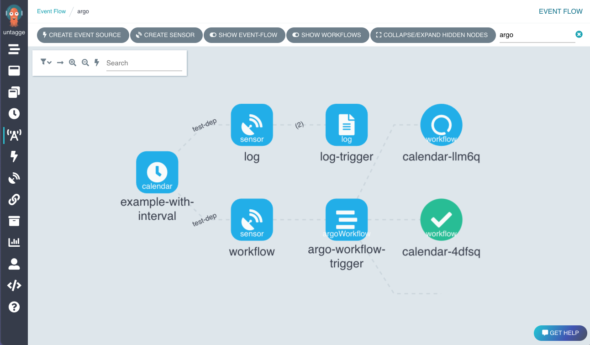

# Argo Events - The Event-driven Workflow Automation Framework

## What is Argo Events?

**Argo Events** is an event-driven workflow automation framework for Kubernetes. It allows you to trigger 10 different
actions (such as the creation of Kubernetes objects, invoke workflows or serverless workloads) on over 20 different
events (such as webhook, S3 drop, cron schedule, messaging queues - e.g. Kafka, GCP PubSub, SNS, SQS).

## Features

* Supports events from [20+ event sources](https://argoproj.github.io/argo-events/concepts/event_source/)
  and [10+ triggers](https://argoproj.github.io/argo-events/concepts/trigger/).
* Ability to customize business-level constraint logic for workflow automation.
* Manage everything from simple, linear, real-time to complex, multi-source events.
* [CloudEvents](https://cloudevents.io/) compliant.

## Try Argo Events

[Access the demo environment](https://workflows.apps.argoproj.io/event-flow/argo?showWorkflows=true) (login using
GitHub)

## Getting Started

Follow these [instructions](https://argoproj.github.io/argo-events/installation/) to set up Argo Events.

## User Interface/API

Argo Workflows has an API and user interface that support Argo Events.

## Documentation

- [Concepts](https://argoproj.github.io/argo-events/concepts/architecture/)
- [Argo Events in action](https://argoproj.github.io/argo-events/quick_start/)
- [Deploy event-sources and sensors](https://argoproj.github.io/argo-events/eventsources/setup/webhook/)
- [Deep dive into Argo Events](https://argoproj.github.io/argo-events/tutorials/01-introduction/)

## Blogs and Presentations

* [Awesome-Argo: A Curated List of Awesome Projects and Resources Related to Argo](https://github.com/terrytangyuan/awesome-argo)
* [Automation of Everything - How To Combine Argo Events, Workflows & Pipelines, CD, and Rollouts](https://youtu.be/XNXJtxkUKeY)
* [Argo Events - Event-Based Dependency Manager for Kubernetes](https://youtu.be/sUPkGChvD54)
* [Argo Events Deep-dive](https://youtu.be/U4tCYcCK20w)
* [Automating Research Workflows at BlackRock](https://www.youtube.com/watch?v=ZK510prml8o)
* [Designing A Complete CI/CD Pipeline Using Argo Events, Workflows, and CD](https://www.slideshare.net/JulianMazzitelli/designing-a-complete-ci-cd-pipeline-using-argo-events-workflow-and-cd-products-228452500)
* TGI Kubernetes with Joe
  Beda: [CloudEvents and Argo Events](https://www.youtube.com/watch?v=LQbBgQnUs_k&list=PL7bmigfV0EqQzxcNpmcdTJ9eFRPBe-iZa&index=2&t=0s)

## Who uses Argo Events?

[Official Argo Events user list](USERS.md)

## Contribute

Participation in the Argo Events project is governed by
the [CNCF Code of Conduct](https://github.com/cncf/foundation/blob/master/code-of-conduct.md).

[Contributions](https://github.com/argoproj/argo-events/issues) are more than welcome, if you are interested take a look
at our [Contributing Guidelines](./docs/CONTRIBUTING.md).

## License

Apache License Version 2.0, see [LICENSE](./LICENSE)

## Security

Please see [SECURITY.md](https://github.com/argoproj/argo-events/blob/master/SECURITY.md)
