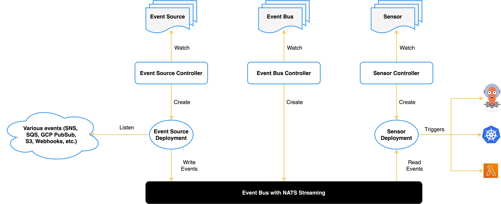

# Architecture

 

 

Main components of Argo Events are:

1. [Event Source](https://argoproj.github.io/argo-events/concepts/event_source/)

1. [Sensor](https://argoproj.github.io/argo-events/concepts/sensor/)

1. [Eventbus](https://argoproj.github.io/argo-events/concepts/eventbus/)

1. [Trigger](https://argoproj.github.io/argo-events/concepts/trigger/)
