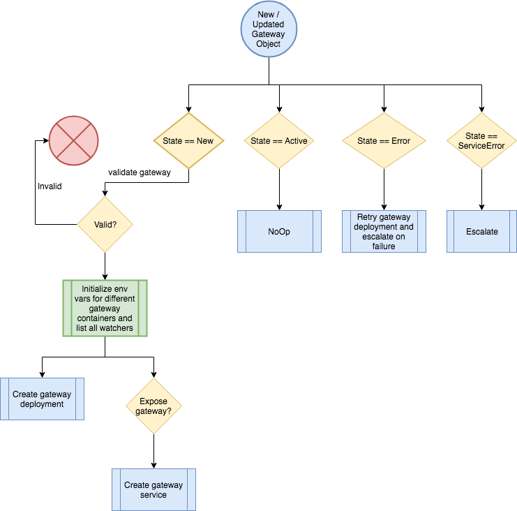

## Controllers

* Sensor and Gateway controller are the components which manage Sensor and Gateway resources. 
* Sensor and Gateway are Kubernetes Custom Resources. For more information on K8 CRDs visit, https://kubernetes.io/docs/concepts/extend-kubernetes/api-extension/custom-resources/


### Controller configmap
Provide the `instance-id` and the namespace for controller
controller configmap
e.g. 
```yaml
# The gateway-controller configmap includes configuration information for the gateway-controller
apiVersion: v1
kind: ConfigMap
metadata:
  name: gateway-controller-configmap
data:
  config: |
    instanceID: argo-events  # mandatory
    namespace: my-custom-namespace # optional
```

If you don't provide namespace, controller will watch all namespaces for gateway resource. 

<b>Note on `instance-id`</b>: it is used to map a gateway or sn to a controller. 
e.g. when you create a gateway with label `gateways.argoproj.io/gateway-controller-instanceid: argo-events`, a
 controller with label `argo-events` will process that gateway. `instance-id` for controller are managed using [controller-configmap](https://raw.githubusercontent.com/argoproj/argo-events/master/hack/k8s/manifests/gateway-controller-configmap.yaml)
Basically `instance-id` is used to horizontally scale controllers, so you won't end up overwhelming a controller with large
 number of gateways or sensors. Also keep in mind that `instance-id` has nothing to do with namespace where you are
 deploying controllers and gateways/sensors.


### Gateway controller
Gateway controller watches gateway resource and manages lifecycle of a gateway.
```yaml
# The gateway-controller listens for changes on the gateway CRD and creates gateway
apiVersion: apps/v1beta1
kind: Deployment
metadata:
  name: gateway-controller
spec:
  replicas: 1
  template:
    metadata:
      labels:
        app: gateway-controller
    spec:
      serviceAccountName: argo-events-sa
      containers:
      - name: gateway-controller
        image: argoproj/gateway-controller:latest
        imagePullPolicy: Always
        env:
          - name: GATEWAY_NAMESPACE
            valueFrom:
              fieldRef:
                fieldPath: metadata.namespace
          - name: GATEWAY_CONTROLLER_CONFIG_MAP
            value: gateway-controller-configmap
```

* <b>Lifecycle of Gateway in gateway controller</b>
  
  

### Sensor controller
Sensor controller watches sn resource and manages lifecycle of a sn.
```yaml
# The sn-controller listens for changes on the sn CRD and creates sn executor jobs
apiVersion: apps/v1beta1
kind: Deployment
metadata:
  name: sn-controller
spec:
  replicas: 1
  template:
    metadata:
      labels:
        app: sn-controller
    spec:
      serviceAccountName: argo-events-sa
      containers:
      - name: sn-controller
        image: argoproj/sn-controller:latest
        imagePullPolicy: Always
        env:
          - name: SENSOR_NAMESPACE
            valueFrom:
              fieldRef:
                fieldPath: metadata.namespace
          - name: SENSOR_CONFIG_MAP
            value: sn-controller-configmap
```

* <b>Lifecycle of a Sensor managed by sn controller</b>

    
 
 <br/>
 
* <b>Lifecycle of  Sensor within sn pod</b>
   
   
   