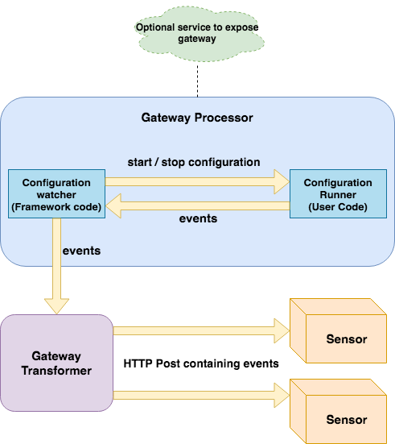
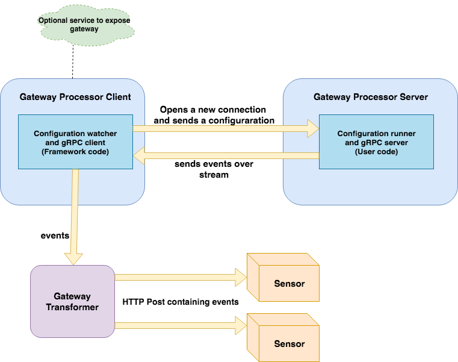
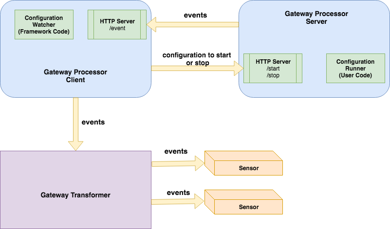

# Custom Gateway

You can write a gateway in 4 different ways,

1. Core gateway style.
2. Implement gateway as a gRPC server.
3. Implement gateway as a HTTP server.
4. Write your own implementation completely independent of framework.

Difference between first three options and fourth is that in options 1,2 and 3, framework provides a mechanism
to watch configuration updates, start/stop a configuration dynamically. In option 4, its up to
user to watch configuration updates and take actions.

##### Below are the environment variables provided to all kinds of gateways
 
 |  Field               |  Description |
 |----------------------|--------------|
 | TRANSFORMER_PORT     | Env var for http server port running within gateway transformer |
 |  ARGO_EVENTS_NAMESPACE | Env var for the namespace of the controller & services |
 |  GATEWAY_PROCESSOR_CONFIG_MAP            | Contains grpc server port for gateway processor server |
 |  GATEWAY_NAME             | Env var for name of gateway |
 |  GATEWAY_CONTROLLER_INSTANCE_ID             | Contains gateway controller instance id |
 |  GATEWAY_CONTROLLER_NAME             | Contains name of gateway controller |

## Core Gateway Style
It is the most straightforward option. The gateway consists of two components,

1. Gateway Processor: either generates events internally or listens for external events and then 
passes those events to gateway-transformer

2. Gateway Transformer: transforms incoming events into cloudevents specification compliant events 
and dispatches them to interested sensors. 

* gateway-processor can be exposed via a service using gateway's `serviceSpec`


 
User needs to implement following interface.

```go
func RunConfiguration(config *ConfigData) error
```

ConfigData contains configuration key/name and value.
```go
type ConfigData struct {
	// Src contains name of the configuration
	Src    string
	// Config contains the configuration
	Config string
	// StopCh is used to send a stop signal to configuration runner/executor
	StopCh chan struct{}
	// Active tracks configuration state as running or stopped
	Active bool
}
```

Lets's look at excerpt from NATS gateway's RunConfiguration implementation

```go
    var wg sync.WaitGroup
    wg.Add(1)

    // waits till stop signal.
    go func() {
        <-config.StopCh
        n.gatewayConfig.Log.Info().Str("config", config.Src).Msg("stopping the configuration...")
        n.gatewayConfig.Log.Info().Str("config-key", config.Src).Msg("client disconnected. stopping the configuration...")
        wg.Done()
    }()

    n.gatewayConfig.Log.Info().Str("config-name", config.Src).Msg("running...")
    config.Active = true

    sub, err := conn.Subscribe(s.Attributes[subjectKey], func(msg *natsio.Msg) {
        n.gatewayConfig.Log.Info().Str("config-key", config.Src).Msg("dispatching event to gateway-processor")
        n.gatewayConfig.DispatchEvent(msg.Data, config.Src)
    })
    if err != nil {
        n.gatewayConfig.Log.Error().Str("url", s.URL).Str("subject", s.Attributes[subjectKey]).Err(err).Msg("failed to subscribe to subject")
    } else {
        n.gatewayConfig.Log.Info().Str("config-key", config.Src).Msg("running...")
    }

    wg.Wait()
```

First we create a wait-group and wait for stop signal. We mark configuration as active, subscribe to subject
and listens to incoming messages. As soon as message is consumed, we dispatch the event to framwork code
which takes further actions.

GatewayConfig contains generic configuration for a gateway
```go
type GatewayConfig struct {
	// log provides fast and simple logger dedicated to JSON output
	Log zerolog.Logger
	// Clientset is client for kubernetes API
	Clientset *kubernetes.Clientset
	// Namespace is namespace for the gateway to run inside
	Namespace string	
}
```

The gateway calls WatchGatewayConfigMap(gtEx GatewayExecutor, ctx context.Context) (cache.Controller, error)
and waits forever

```go
// creates a gateway configuration
gatewayConfig := gateways.NewGatewayConfiguration()
// struct that implements RunConfiguration
c := &calendar{
    gatewayConfig,
}
gatewayConfig.WatchGatewayConfigMap(c, context.Background())
select {}
```

* To send events back to framework code for further processing, use
```go
gatewayConfig.DispatchEvent(event []byte, src string) error
```


For detailed implementation, check core gateways [Core Gateways](https://github.com/argoproj/argo-events/tree/eventing/gateways/core)

## gRPC gateway
A gRPC gateway has 3 components, 
1.  Gateway Processor Server - your implementation of gRPC streaming server, either generates events or listens to 
external events and streams them back to gateway-processor-client

2. Gateway Processor Client - gRPC client provided by framework that connects to gateway processor server.

3. Gateway Transformer: transforms incoming events into cloudevents specification compliant events 
   and dispatches them to interested sensors. 

### Architecture
 
 
To implement gateway processor server, you will need to implement 
```proto
RunGateway(GatewayConfig) returns (stream Event)
```
`RunGateway` method takes an gateway configuration and sends events over a stream.

The gateway processor client opens a new connection for each gateway configuration and start listening to
events on the stream.

For detailed implementation, check out [Calendar gRPC gateway](https://github.com/argoproj/argo-events/tree/eventing/gateways/grpc/calendar)

* To run gRPC gateway, you need to provide `rpcPort` in gateway spec.

* To write gateway gRPC server using other languages than go, generate server interfaces using protoc.
Follow protobuf tutorials []()https://developers.google.com/protocol-buffers/docs/tutorials

## HTTP Gateway
A gRPC gateway has 3 components, 
1.  Gateway Processor Server - your implementation of HTTP streaming server, either generates events or listens to 
external events and streams them back to gateway-processor-client. User code must accept POST requests on `/start` and `/stop`
endpoints.

2. Gateway Processor Client - sends configuration to gateway-processor-server on either `/start` endpoint for
a new configuration or `/stop` endpoint to stop a configuration. Processor client itself has a HTTP server 
running internally listening for events from gateway-processor-server.

3. Gateway Transformer: transforms incoming events into cloudevents specification compliant events 
   and dispatches them to interested sensors. 


### Architecture


List of environment variables available to user code

|  Field               |  Description |
|----------------------|--------------|
| GATEWAY_PROCESSOR_SERVER_HTTP_PORT     | Gateway processor server HTTP server port |
|  GATEWAY_PROCESSOR_CLIENT_HTTP_PORT | Gateway processor client HTTP server port  |
|  GATEWAY_HTTP_CONFIG_START            | REST endpoint to post new configuration |
|  GATEWAY_HTTP_CONFIG_STOP             | REST endpoint to make configuration to stop |
|  GATEWAY_HTTP_CONFIG_EVENT             | REST endpoint to send events to |


For detailed implementation, check out [Calendar HTTP gateway](https://github.com/argoproj/argo-events/tree/eventing/gateways/rest/calendar)

###### Advantage of writing a gRPC or http gateway is that you can use other languages for implementation of gateway processor server.   


## No framework gateway code
The third option is you provide gateway implementation from scratch, watch the configuration
updates,  start/stop configuration if needed. Only requirement is that events must be 
dispatched to gateway-transformer using HTTP post request. The port to dispatch the request
is made available through environment variable `TRANSFORMER_PORT`.

List of environment variables available to user code
 
|  Field               |  Description |
|----------------------|--------------|
| TRANSFORMER_PORT     | Gateway transformer port to send HTTP POST request to |
|  ARGO_EVENTS_NAMESPACE | Namespace where gateway is deployed  |
|  GATEWAY_PROCESSOR_CONFIG_MAP                | Name of ConfigMap for gateway configuration |
|  GATEWAY_NAME             | Gateway name  |

### Gateway Specs
* Example gateway specs is available at [gateway examples](https://github.com/argoproj/argo-events/tree/eventing/examples/gateways)