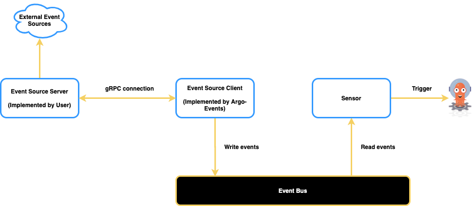

# Generic EventSource

Generic eventsource extends Argo-Events eventsources via a simple gRPC contract.
This is specifically useful when you want to onboard a custom eventsource
implementation.

## Contract

In order to qualify as generic eventsource, the eventsource server needs to
implement following gRPC contract.

        syntax = "proto3";

        package generic;

        service Eventing {
            rpc StartEventSource(EventSource) returns (stream Event);
        }

        message EventSource {
            // The event source name.
            string name = 1;
            // The event source configuration value.
            bytes config = 2;
        }

        /**
        * Represents an event
        */
        message Event {
            // The event source name.
            string name = 1;
            // The event payload.
            bytes payload = 2;
        }

The proto file is available [here](https://github.com/argoproj/argo-events/blob/master/eventsources/sources/generic/generic.proto).

## Architecture

Consider a generic eventsource.

        apiVersion: argoproj.io/v1alpha1
        kind: EventSource
        metadata:
          name: generic
        spec:
          generic:
            example:
              insecure: true
              url: "generic-event-source-server.argo-events.svc:8080"
              config: |-
                key1: value1
                key2: value2

The values placed under `config` field follows a free-form style and Argo-Events
eventsource client is not opinionated about them. Although, it is expected that
the eventsource server implemented by the user is able to parse the
configuration.

## Flow

1. The eventsource client connects to the server via the `url` defined under
   eventsource `spec` and sends over the configuration defined under `config`
   over an RPC call.

2. The eventsource server then parses the configuration and connects to any
   external source if required to consume the events. The eventsource server can
   produce events without connecting to any external source, e.g. a special
   implementation of calendar events.

3. The events from eventsource server are streamed back to the client.

4. Client then writes the events to the eventbus which are read by the sensor to
   trigger the workflows.

## Connection Strategy

The eventsource client performs indefinite retries to connect to the eventsource
server and receives events over a stream upon successful connection. This also
applies when the eventsource server goes down.
